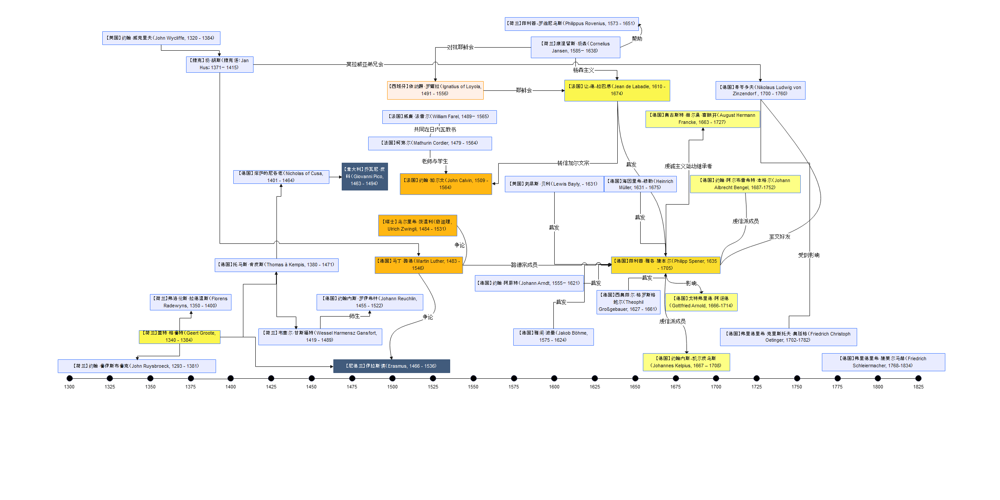

- 研究资料
	- 现代虔信派
		- https://baike.baidu.com/item/%E7%8E%B0%E4%BB%A3%E8%99%94%E4%BF%A1%E6%B4%BE/23150572?fr=aladdin
	- Discontent with the Roman Catholic Church
	- https://courses.lumenlearning.com/atd-herkimer-westerncivilization/chapter/discontent-with-the-roman-catholic-church
	- 虔信派的简史
		- https://zhidao.baidu.com/question/330306661960280805.html
	- 虔信派和佛兰克
		- https://xuewen.cnki.net/R2017050020000498.html
	- 虔信派
		- https://baike.baidu.com/item/%E8%99%94%E4%BF%A1%E6%B4%BE/4585657?fr=aladdin
- 人物
	- 【荷兰】[[约翰·鲁伊斯布鲁克]]（John Ruysbroeck, 1293 - 1381）
	- 【英国】[[约翰·威克里夫]]（John Wycliffe, 1320 - 1384）
	- 【荷兰】[[盖特·格鲁特]]（Geert Groote, 1340 - 1384）
	- 【荷兰】[[弗洛伦斯·拉德温斯]]（Florens Radewyns, 1350 - 1400）
	- 【捷克】[[扬·胡斯]]（捷克语：Jan Hus；1371－1415）
	- 【德国】[[托马斯·肯皮斯]]（Thomas à Kempis, 1380 - 1471）
	- 【德国】[[库萨的尼各老]]（Nicholas of Cusa, 1401 - 1464）
	- 【荷兰】[[韦塞尔·甘斯福特]]（Wessel Harmensz Gansfort, 1419 - 1489）
	- 【德国】[[约翰内斯·罗伊希林]]（Johann Reuchlin, 1455 - 1522）
	- 【意大利】[[乔瓦尼·皮科]]（Giovanni Pico della Mirandola, 1463 - 1494）
	- 【尼德兰】[[伊拉斯谟]]（Erasmus, 1466 - 1536）
	- 【法国】[[柯第尔]]（Mathurin Cordier, 1479 - 1564）
	- 【德国】[[马丁·路德]]（Martin Luther, 1483 - 1546）
	- 【瑞士】[[乌尔里希·茨温利]]（慈运理, Ulrich Zwingli, 1484 - 1531）
	- 【法国】[[威廉·法雷尔]]（William Farel, 1489－1565）
	- 【西班牙】[[依纳爵·罗耀拉]]（Ignatius of Loyola, 1491 - 1556）
	- 【法国】[[约翰·加尔文]]（John Calvin, 1509 - 1564）
	- 【德国】[[约翰·阿恩特]]（Johann Arndt, 1555－1621）
	- 【英国】[[刘易斯·贝利]]（Lewis Bayly, - 1631）
	- 【荷兰】[[菲利普-罗维尼乌斯]]（Philippus Rovenius, 1573 - 1651）
	- 【德国】[[雅阁·波墨]]（Jakob Böhme, 1575 - 1624）
	- 【荷兰】[[康涅留斯·杨森]]（Cornelius Jansen, 1585－1638）
	- 【法国】[[让-德-拉巴底]]（Jean de Labadie, 1610 - 1674）
	- 【德国】[[西奥菲尔·格罗斯格鲍尔]]（Theophil Großgebauer, 1627 - 1661）
	- 【德国】[[海因里希-穆勒]]（Heinrich Müller, 1631 - 1675）
	- 【德国】[[菲利普·雅各·施本尔]]（Philipp Spener, 1635 - 1705）
	- 【德国】[[奥古斯特·赫尔曼·富朗开]]（August Hermann Francke, 1663 - 1727）
	- 【德国】[[戈特弗里德·阿诺德]]（Gottfried Arnold, 1666-1714）
	- 【德国】[[约翰内斯-凯尔皮乌斯]]（Johannes Kelpius, 1667 – 1708）
	- 【德国】[[约翰·阿尔布雷希特·本格尔]]（Johann Albrecht Bengel, 1687-1752）
	- 【德国】[[尼古劳斯·路德维希·青岑多夫]]（Nikolaus Ludwig von Zinzendorf und Pottendorf, 1700 - 1760）
	- 【德国】[[弗里德里希·克里斯托夫·奥廷格]]（Friedrich Christoph Oetinger, 1702-1782）
	- 【德国】[[弗里德里希·施莱尔马赫]]（Friedrich Schleiermacher, 1768-1834）
- 组织
	- [[奥斯定会]]（Augustinians）
	- [[罗拉德派]]（Lollardy）
	- [[共同生活弟兄会]]（Brethren of the Common Life, 14世纪末至16世纪）
	- [[耶稣会]]（Society of Jesus）
	- [[摩拉维亚弟兄会]]（Moravian Church）
	- [[拉巴底派]]（Labadists, 1669）
- 著作
	- 《[[圣奥古斯丁的规则]]》（Rule of Saint Augustine, 400）
	- 《[[师主篇]]》（The Imitation of Christ, 拉丁语：De Imitatione Christi, 1418-1427）
	- 《[[有知识的无知]]》（De Docta Ignorantia, 拉丁语：On learned ignorance/on scientific ignorance，1440）
	- 《[[论人的尊严]]》（Oration on the Dignity of Man, 1486）
	- 《[[法拉戈神学研究]]》（Farrago Rerum Theologicarum, 又名 Sum of Christianity, 1521）
	- 《 [[基督教要义]] 》（Institutes of the Christian Religion, 1536）
	- 《 [[真正的基督教]] 》（Wahres Christentum, 1605 - 1610）
	- 《[[虔诚的实践]]》（The Practice of Piety, 第三版 1613）
	- 《[[通过牧师制度改革教会]]》（The Reform of the Church Through the Pastorate, 1667）
	- 《[[荒凉锡安的守望者之声]]》（Wächterstimme aus dem verwüsteten Zion）
	- 《[[敬虔愿望]]》（Pia desideria）
- 思潮
	- [[基督教神秘主义]]（Christian mysticism）
	- [[杨森主义]]（Jansenism）
	- [[加尔文主义]]（Calvinism）
	- [[虔诚主义]]（Pietism）
	- [[激进的虔诚主义]]（Radical Pietism）
- 运动
	- [[现代奉献运动]]（Devotio Moderna）
	- [[扬·胡斯]]运动
	- [[宗教改革]]运动
- 人物关系图
  id:: 6282edee-9bc6-42db-881b-93a67c72d4ae
  