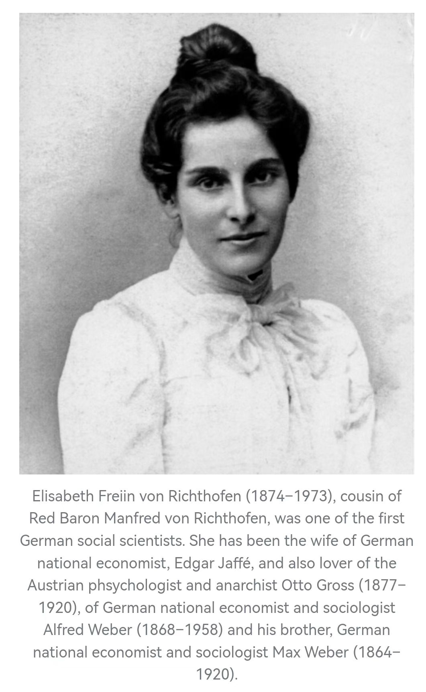

- _1652667781653_0.pdf)
- 第一章 家世
	- 一个八卦，似乎韦伯的母亲在16岁的时候，遇到很糟糕的“骚扰”，但是作者为尊者讳了。
- 第二章 父母与少年时代
	- 主要介绍的是他读大学之前的儿童与少年时代。
	- 对照着杨照老师的音频课程，也介绍了韦伯的成长经历。杨照老师讲得比较简单：韦伯父母不和，他就有点自我封闭，小小年纪就以学术为逃避，14岁就发表了两篇历史研究的学术论文。
	- 果然，天才就是这么厉害，一样是童年创伤，看看人家是怎么化解的。
- 第三章 大学生活与服兵役时期
	- 这本书最大的优点就是文字优美，翻译流畅。里面出现的人物，都栩栩如生。较之上一本阅读的《爱这个世界--汉娜阿伦特传》，确实好看多了。
	- 主要讲了他的军队生涯与大学生活，非常有意思的，其实都是一些细节，一个正在成长和成熟中青年。我最喜欢的，是韦伯写个五岁小妹妹一封信，真是一个非常可亲的大哥哥。
- 第四章 崭露头角
	- 一个学者的成长历程，以及他所处的时代，在呼唤什么样的研究。大背景与个人努力之间的关系，介绍得非常清楚。也能看出来，从俾斯麦以来，德国的思想界，就已经逐步孕育了国家社会主义的苗头了。
	- {:height 525, :width 316}
- 第五章 家中生活与个人发展
	- 感觉还是比较琐碎的一章。有各种亲友、家人的事情，有个人成长，也有成长中的困扰。比较有意思的是：书中提到韦伯直到当上讲师，做了副教授，也没觉得自己能够成为一位学者。
- 第六章 婚姻
	- 其实感觉很奇妙，作者以第三人称描述自己的生活。还有韦伯与前女友的种种分分合合（当年的德国，好多人都有精神问题啊）。最后有一点我受打击了：“今天我读了100页生理心理学，100页认识论，一本意大利法学著作……”，高产还是由高效决定的呀。
- 第七章 青年教师与政治家 & 第八章 精神崩溃
	- 最令我有感触的，是韦伯生病之后的疗养经历，我也在猜想那是一种什么样的精神疾病？
	- 也许，作为最早进入“现代”的德国，人必须自立，必须有自己的职业，必须发挥自己所长的压力，是一种非常新的现代现象。而韦伯，以及他的表弟，还有很多周围的亲朋好友，是现代化最早的一批受害者。
- 第九章 新阶段
	- 韦伯从大学辞职，转为独立研究者，心理疾病也逐渐得以康复，还去美国游访了一年，这对于他写作《新教伦理与资本主义精神》，大有助益。期待明天将要阅读的一章，会较为详细的介绍他的思想与著作。
	- 说实话，这本传记作为人物传记很好，但是作为思想传记就太缺乏了。
- 第十章 著述的新阶段
	- 这是非常有价值的一章，作者系统性的阐释了韦伯的学术脉络，思想立场，并简要解读了《新教伦理与资本主义精神》的概要。
	- 一个小八卦：1905年第一次俄国革命，韦伯为了了解俄罗斯的情况，用最快的速度学会了俄语，然后就开始阅读俄文报纸了……
- 第十一章 拓展
	- 比较令我感兴趣的，是在190x年就在德国出现的“性解放”运动，简直超前，果然是最早踏入现代化的国家。
	- 只可惜，这本书太多的引述，都是韦伯夫妇的隐晦评论，缺少太多惊爆细节，唉
- 第十二章 历经世事与论辩诉讼
	- 这一章有45页，确实比较长了。
	- 这一章，介绍了很多内容，跟人打笔仗，打官司，甚至差点跟人决斗。这让我联想到了1804年去世的亚历山大·汉密尔顿。差不多是比韦伯早100年的人。没想到，在100年后，德国还有决斗的风气。但是，关于政治斗争的那些内容，说实话，因为缺少太多的背景介绍，我看得云里雾里的。
	- 比较有趣的段落，是韦伯以一己之力创建社会学的过程，一门新学科的创建，真的是艰难啊。
- 第十三章 美好生活
	- 这一章我很喜欢，是思想传记的最合适的写法。介绍一位当时的思想家或者诗人、文学家、批评家，然后介绍他与韦伯的交往，以及思想交流的情况，一方面介绍对方的情况，也介绍韦伯对其思想的评论，这样就很能够看出条理来。
	- 另外，我还查了一下格奥尔格的简介，1868年07月12日 至 1933年12月04日，德国20世纪初叶最重要的诗人之一。百度百科介绍中有一句：格奥尔格在政治上虽没有同德国法西斯同流合污，但法西斯的宣传机构仍然利用他的思想为第三帝国服务。
	- 对照书中描述，格奥尔格：“谈到战争对人类的英雄本色而言是一件幸事...谈到了世界日益增长的和平安宁造成我们的麻烦与麻痹，让我们连一只鸡都杀不了。”但是：“他也承认自己无力从事这一勇敢的行为。”这就使得我们感受了一种：鼓吹战争的诗人的文弱形象。
- 第十四章 旅行散记
	- 确实是散记，就是各种风景描写，看画展，看戏剧，听音乐剧，还有逛展览。作为夫妻两人的生活记录，当然是很好，也很丰富。但是作为人物传记，确实有点水了。
- 第十五章 母亲
	- 读了一段进入第一次世界大战阶段的韦伯。母亲的部分写得很好，相当感人。一战开始之后，仅仅是韦伯家里，就死了一位妹夫，和一个弟弟。另外还有其他一些亲友。但是，当时的德国，真是充满了爱国主义激情啊，大多数人都将战死沙场，视为崇高的牺牲……
- 第十六章 为国效力
	- 韦伯当了一段时间的多家战时医院的管理者，忙得不亦乐乎，还从一个学者的视角出发，讨论战时医院的各种管理问题。我的收获是，当时的大多数德国人，出于积极的、主动的爱国热情，从各方面投入自己的支持。这是我没法想象，但可以理解的一面。
- 第十七章 革命前夜的政治家
	- 其实我很替韦伯感到悲哀。他明明只是一个学者，却希望能够尽力影响当下的政治。尤其是在第一次世界大战时的德国，绝大多数民众都处在狂热之中，区区一个清醒的学者，又能产生什么影响呢？虽然他写了很多信，他的妻子尽力摘录了很多看起来都很有道理的文字……
- 第十八章 间奏
	- 韦伯不在军队当军医院的管理者，去了维也纳上了一个学期的课，虽然非常辛苦，但是应该也非常满足，因为来上他的课的人，越来越多，最大的课堂都挤满了人，靠墙站都站不下了。这大概才是一个学者最理想的状态吧。可惜，下一章一战结束，韦伯又要投身政治了。
- 第十九章 革命后的政治家
	- 德国战败后，国内各种纷争，韦伯参与了宪法的制定，也去参加了巴黎和会。不过，宪法的部分，作者没有提及魏玛宪法第48条，只是着重提到了少数党派的质询权。对于和谈的部分，其实谁去都没用，因为战败国就是没有办法。更何况当时的列强，一心想彻底干掉德国。不过，韦伯他们打算拒签合约，其实又能如何呢？
- 第二十章 教师与思想家
	- 先介绍了韦伯的教师的一面，然后非常概要性的介绍了韦伯的思想。作为一篇短文，提纲摘要的将韦伯的主要思想串联了起来，对我最有启发的，是范畴学、理想类型、以及对于政治作为志业的概述。
- 第二十一章 生命的最后乐章
	- 终于，今天读完了《韦伯传》的最后一章，以及后续的部分。传主的突然逝去，总是令人伤感的。唯一令我疑惑的是，作为一种巨大杀伤力的流感病毒，为啥当时的人们都似乎全无察觉，毫不防范呢？可能正是因为这样的原因，大流感才会夺走这么多人的生命吧。看完译者后记，译者也隐晦的透露出：玛丽安妮的写作，因为为丈夫讳的原因，抹去了不少的事情。还得另外找一些资料了。